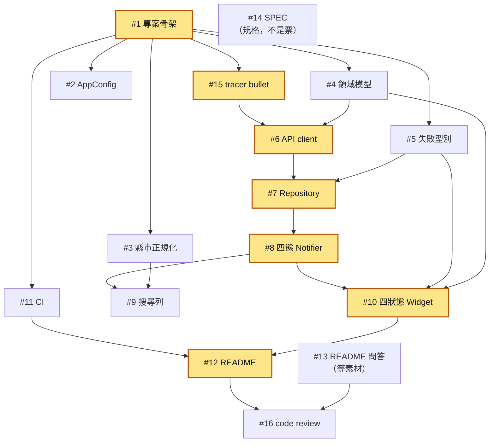

# 36 小時天氣預報

查詢臺灣 22 縣市今明 36 小時天氣預報的單頁 Flutter App。

打「台北」「北」「臺北市」都找得到，選好按確認，看到三個預報時段的天氣描述與圖示、溫度區間、降雨機率與舒適度。資料來自中央氣象署開放資料平臺。

---

## 快速開始

需要 Flutter SDK 與一台 Android 或 iOS 的模擬器或實機。**本專案以 Flutter 3.47.0（Dart 3.13.0）開發與驗證**，CI 也鎖同一版。

```bash
git clone https://github.com/allenljf/weather-forecast-flutter.git
cd weather-forecast-flutter
flutter pub get
flutter run --dart-define-from-file=dart_defines/reviewer.json
```

就這樣，不必申請任何帳號。`dart_defines/reviewer.json` 裡附了一組**可以直接使用的中央氣象署授權碼**——它是刻意公開的，理由與取捨寫在下面的[安全章節](#安全正式專案該如何保護-token)。

### 指定 Android 或 iOS 裝置

Android 與 iOS 是同一條指令，只差 `-d`：

```bash
flutter devices    # 列出可用裝置，複製要用的 device id

# Android（模擬器或 USB 實機皆同）
flutter run -d emulator-5554 --dart-define-from-file=dart_defines/reviewer.json

# iOS 模擬器
open -a Simulator
flutter run -d <simulator-id> --dart-define-from-file=dart_defines/reviewer.json
```

只接一台裝置時可以整個省略 `-d`。iOS 實機需要在 Xcode 設定自己的簽章團隊。

### 從 IDE 執行

`--dart-define-from-file` 得傳給 Flutter，而 **IDE 的預設 Run 按鈕不會自動帶上**，直接按會看到啟動時的授權碼缺失訊息。

| IDE | 做法 |
| --- | --- |
| VS Code | Run and Debug 側欄選 **weather_forecast (reviewer token)** 再按 F5。`.vscode/launch.json` 已附在 repo 裡。 |
| Android Studio／IntelliJ | `Run → Edit Configurations… → main.dart → Additional run args` 填入 `--dart-define-from-file=dart_defines/reviewer.json`。`.idea/` 不進版控，這一步要自己做一次。 |

請選 **main.dart** 這個 Flutter 設定，不要用 Android Studio 工具列上的 Android **app**（Gradle）設定——那條路徑繞過 Flutter CLI，`--dart-define` 傳不進去。

`--dart-define` 是**編譯期**注入。改了 `dart_defines/*.json` 之後，hot reload 與 hot restart 都不會生效，必須完全結束 `flutter run` 重跑。

### 想改用自己的授權碼

到[中央氣象署開放資料平臺](https://opendata.cwa.gov.tw/)免費申請，然後：

```bash
cp dart_defines/dev.example.json dart_defines/dev.json
# 編輯 dev.json，填入 WEATHER_API_TOKEN
flutter run --dart-define-from-file=dart_defines/dev.json
```

`dev.json` 已被 `.gitignore` 排除，不會被誤推上版控。整個過程不需要修改任何一行程式碼。

### 忘記帶授權碼會怎樣

App 在 `main()` 第一行就中止，並印出一段**含完整可複製執行指令**的訊息。授權碼是組態而非領域資料：缺少它是設定錯誤，不會偽裝成「查詢失敗」的畫面狀態。

### 跑測試

```bash
flutter test              # 全部走替身，不打真的 API
flutter analyze
```

---

## 架構

`lib/` 依技術層切成四層，依賴方向單向朝內：

| 層 | 責任 | 依賴 |
| --- | --- | --- |
| `core` | 組態。全 app 唯一讀取編譯期環境值的位置，加上啟動期檢查。 | 無 |
| `domain` | 領域。22 縣市清單與正規化、預報時段模型、天氣分類、相對日格式化、六種失敗型別、repository 介面。 | **純 Dart，零 Flutter 依賴** |
| `data` | 資料。Dio 設定與 header 認證、DTO 與嚴格解析、失敗映射、repository 實作。 | `domain` |
| `presentation` | 呈現。四態 notifier、四個狀態 Widget、搜尋列與自動完成、主題。 | `domain` |

`domain` 零 Flutter 依賴不是風格宣言，是一個可被驗證的約束：那個資料夾整個都能用純 Dart 單測跑起來，不需要 Flutter binding。專案的核心邏輯（哪些輸入合法、資料長什麼樣、失敗有幾種）因此不必開模擬器就能驗證。

### 為什麼用自訂 sealed 四態，而不是 `AsyncValue`

需求明定顯示區塊恰好四種狀態：初始、讀取中、氣象資料、錯誤。Riverpod 的 `AsyncValue` 確實是 sealed，但只有 `loading` / `data` / `error` **三個**子型別，沒有「使用者還沒查過任何東西」。用 `AsyncValue` 就得再搭一個「查詢字串是否為 null」的旁路訊號來補出第四態，四態的窮舉性也就散在兩個地方。

自訂 sealed 四態讓畫面收斂成單一 exhaustive `switch`：漏掉一種狀態是編譯錯誤，不是執行期的空白畫面。

附帶效果值得一提：因為 notifier 的 `build()` 永不拋出例外，失敗是回傳值而不是例外，Riverpod 3 的**自動重試**（會把一次失敗放大成連續五次 API 請求）與 `ProviderException` 包裹在本專案完全不會被觸發，也就不需要在 `ProviderScope` 上關掉它們。

### 為什麼沒有 usecase 層

只有一個端點、一次呼叫。usecase 會是一個把 repository 方法原樣轉發一次的類別——它不做決策、不組合、不轉換，加進來只會讓每次讀程式碼多跳一層。

但 **repository 抽象介面保留了**，因為它有實際在付出的價值：它是測試替身的邊界，狀態機測試靠它才能不碰網路。抽象要留，判準是它擋住了什麼，不是分層圖上該不該有那一格。

---

## 需求的邊界狀況與如何處理

這三件事都是實際呼叫上游測出來的，不是從文件推測的。

### 上游對錯誤輸入完全靜默

查一個不存在的縣市，中央氣象署回的是 **HTTP 200、成功旗標為真、資料陣列為空**。把「臺」打成「台」，跟送一串完全無意義的亂碼，兩者的回應**位元組完全相同**。上游從不回報輸入錯誤。

所以：**本地的 22 縣市白名單是本專案唯一的輸入有效性判定來源**。這不是為了少打一次 API，是因為沒有別的東西能判定。

### 官方名稱一律用「臺」不用「台」

`臺北市`、`臺中市`、`臺南市`、`臺東縣` 在上游都是「臺」。而多數人打字打的是「台」。所以正規化涵蓋：去除前後空白、「台」與「臺」互換、常見簡稱補全（「桃園」→「桃園市」）。

簡稱補全遇到「新竹」「嘉義」時**刻意不猜**——它們各自同時對得上一個縣與一個市，猜錯會讓使用者拿到另一個縣市的天氣，比查不到更糟。建議清單會把兩個都列出來讓他選。

建議清單也刻意用**包含比對**而非前綴比對：22 個縣市裡有四個以「臺」開頭，前綴比對會讓打「南」的人找不到臺南市。

### 六種失敗，各自的處置

失敗是被窮舉列舉的 sealed 型別，不是一段自由文字。每一種攜帶的診斷欄位本來就不一樣——無效查詢根本沒發出請求，自然沒有狀態碼可帶。

| 失敗 | 何時發生 | 畫面文案 | 可重試 |
| --- | --- | --- | --- |
| 無效查詢 | 正規化失敗，白名單擋下，**未發出任何請求** | 找不到「⋯」，請從建議清單選擇縣市 | 否 |
| 憑證錯誤 | 上游回 401 | 授權碼無效，請更新後再試 | 否 |
| 連線失敗或逾時 | 請求沒能抵達，或 15 秒內沒回應 | 連線失敗，請檢查網路後重試 | 是 |
| 上游服務異常 | 上游回 5xx | 氣象署服務暫時無法使用，請稍後再試 | 是 |
| 回應格式無法解析 | 回 200 但不是合法 JSON，或五個天氣要素缺任一、數值轉型失敗 | 資料格式無法解析 | 是 |
| 上游查無此縣市 | 白名單命中，上游卻回 200 加空陣列 | 氣象署目前沒有「⋯」的預報資料 | 否 |

三個設計要點：

- **「重試沒有意義」的失敗不給重試按鈕**。授權碼錯了，再按一次還是錯的；讓使用者白按只會更困惑。
- **「查無資料」是錯誤，不是第五種狀態**。需求明定四種畫面狀態，多開一種會讓窮舉分支的保證失效。
- **「上游查無此縣市」在本專案只有一個成因**：白名單擋在前面，所以能走到這裡的輸入必定是合法縣市名，空陣列只可能代表本地清單與上游脫鉤。診斷訊息直接這樣寫，而不是含糊地說「查無資料」。

技術細節（完整請求 URL、狀態碼、上游原始回應）收在可展開區塊裡，預設不干擾一般使用者。

### 解析為什麼是嚴格的

五個天氣要素缺任何一個、或數值轉型失敗，一律判定為格式錯誤，整筆作廢。理由是實測顯示正常情況下 22 縣市全量回應的 330 個參數零缺失——**缺失就代表異常**，而偵測異常正是需求要求展示的能力。寬鬆解析（缺的欄位就留白）會讓這條需求永遠無法被示範。

解析一律**依名稱查找，禁止依索引取值**：實測顯示天氣要素與地點的順序都不可依賴，而且每個要素的參數物件鍵組成因要素而異。

---

## 安全：正式專案該如何保護 token

**`--dart-define` 是版控衛生，不是安全機制。** 它解決的是「授權碼不要出現在原始碼裡」，不是「授權碼不會外流」。值最終會被編譯進 binary，APK 可以反組譯取出，iOS 建置產物裡它以 base64 存在。只要 app 裝得到，金鑰就取得到——**client 端沒有真正的機密**。

分層來看，每層防的東西不同：

| 層 | 手段 | 防得住 | 防不住 |
| --- | --- | --- | --- |
| 本機開發 | gitignored 的設定檔 | 誤 commit、貼進截圖 | 拿到 binary 的人 |
| CI/CD | repository secret 注入為環境變數 | 金鑰出現在 workflow 檔與 log | 產出的 artifact 內含金鑰 |
| 發佈產物 | 混淆、字串拆分 | 順手 grep 的人 | 有心的逆向 |

三層加起來只是提高取得成本，沒有一層改變「金鑰在使用者手上」這個事實。

**根本解法是後端 proxy（BFF）**：金鑰由自家後端持有，app 只跟自家後端說話。金鑰不再隨版本散佈，輪替不必重新發版；rate limit 與快取做在伺服器端；client 改用可撤銷的短期憑證。代價是多一個要維運的服務。判準是金鑰的價值——涉及金流、個資或計費的，只能放後端。

**本專案的取捨，誠實說**：`dart_defines/reviewer.json` 裡的授權碼是**刻意公開**的，為的是把審閱門檻降到零。可以接受，是因為它免費、無金流、無個資、最壞後果是失效、且隨時可撤換。這是針對一次性交付物的取捨，不是疏忽；正式專案我會用上面的後端 proxy。取捨之外架構仍是正確的：程式碼零明碼憑證，`.gitignore` 仍在守護 `dev.json` 這條路徑，公開的只是機制上一個可以被指名的例外。

**本專案實際做到的一項防護**：認證改走 HTTP header 而非查詢參數（官方範例都用查詢參數）。授權碼因此不進網址、伺服器 log，也不會出現在錯誤畫面的診斷區塊——那個區塊會顯示完整的請求 URL。

---

## 測試與 CI

測試只在五個接縫上進行，每個接縫都是一個可以觀察外部行為的公開邊界：查詢正規化、回應解析、失敗映射、Repository、四態狀態機。畫面測試在**顯示文字**上觀察，用文字尋找器區分四種狀態，不觸碰內部欄位。

`test/fixtures/cwa/` 下的是**實際呼叫上游後原封不動存下的回應**（正常、多筆、22 縣市全量、空陣列、空要素、憑證錯誤的純文字回應）。格式錯誤的變體由正常回應衍生，並在測試中就地說明改了什麼。不使用憑空杜撰的假資料——假資料只能驗證我對 API 的想像。

CI 有五個 job：`analyze`、`test`（產生覆蓋率報告但**不設門檻**）、`codegen-check`（證明 committed 的 `*.g.dart` 沒有與原始碼脫節）、`build-android`、`build-ios --simulator`。後兩者對應需求原文的「在 Android 和 iOS 模擬器上可以運作」。

**CI 完全不使用任何 secret，這是刻意的，不是漏掉了。** 測試全走替身；而建置階段本來就不需要授權碼——`String.fromEnvironment` 在未定義時回傳空字串，編譯照樣通過，檢查發生在執行期。這個 repo 設定過一個 `WEATHER_API_TOKEN` secret，workflow 沒有使用它。

也刻意**不加「呼叫真實 API 的健康檢查」**：那會把中央氣象署的可用性接進本交付物的驗證流程，讓一個與程式碼無關的上游故障把 CI 變紅。

不做視覺快照測試：跨平台字型差異會造成不穩定，而在一個會被打開來看的交付物上，紅色的驗證結果是負分而不是加分。

---

## AI 使用說明

**工具：GitHub Copilot（VS Code），模型 Claude Opus 5。工作流骨幹用的是 Matt Pocock 的 agent skills 集合。**

用法不是「叫它寫功能」，而是三個階段：

**一、先被拷問，再寫規格。** 動工之前，先讓 AI 扮演資深架構師，針對每一個含糊處反覆逼問：使用者自由輸入撞上 API 只認 22 個精確名稱怎麼辦、公開 repo 的授權碼怎麼處理、`AsyncValue` 三態撞上需求四態怎麼選、空陣列到底算誰的錯。共 37 題。每一題都留下被否決的選項與否決的理由——**沒有被記錄下來的替代方案，等於沒有被考慮過**。過程中有數個早期決定被後來的實測推翻，推翻的紀錄也留著。

**二、規格定稿後才拆票。** 拷問的結論收斂成一份規格與一份詞彙表，再由規格拆成 GitHub Issues。票只寫「要建什麼」與驗收條件，決策理由一律以編號引用回拷問紀錄——三份文件各司其職、互不抄寫，否則會養出互相矛盾的規格。

**三、一次一張票，逐票交付。** 每張票獨立開一個 session，讀規格、實作、測試、commit、關票、交棒給下一張。

### 用到的 skill

| Skill | 做什麼 | 本專案的產物 |
| --- | --- | --- |
| `/grill-with-docs` | 扮演資深架構師逐輪拷問。事實由 AI 自己查證並附來源，選項與取捨由 AI 攤開，決策由人做；每輪回答完立刻寫進紀錄 | 七輪、37 項決策 → [docs/GRILL_LOG.md](docs/GRILL_LOG.md)、[CONTEXT.md](CONTEXT.md) |
| `/to-spec` | 把已談定的共識收斂成結構化規格，每條決策標注來源編號 | issue #14：42 條 user story、五個測試接縫、Out of Scope |
| `/to-tickets` | 把規格切成 AI 單次任務可完成的票，並要求 tracer bullet 先行 | issue #15，以及票與票之間的原生相依邊 |
| `/implement` | 逐票實作：讀規格、走 TDD、跑檢查、commit、關票、交棒 | 一張票一個 session、一個 commit |
| `/tdd` | 紅燈 → 綠燈 → 重構，且只在事先講好的接縫上測 | 86 個測試，全部落在五個接縫 |
| `/code-review` | 分兩軸審閱：是否符合 repo 的標準、是否符合原始票的規格 | 報告貼回 GitHub issue 留痕（Q37） |

誠實的一點：**#1–#13 是在讀 `/to-tickets` 之前先手工切的**。後來對照 skill 的 tracer bullet 規則才發現這批票全是水平切分，缺垂直驗證——補一張 #15 是折衷，不是重切。

### 票為什麼是這樣切的

這批實作票是**依技術層水平切**的：一張票一層。這違反 tracer bullet 的常規（常規是縱切，每張票都端到端跑通一條窄路），而且是刻意的——這個專案要同時呈現「一個人類團隊會怎麼分工」，水平切分才能讓每張票有明確的技能屬性，所以每張票的 body 都寫了「建議承接者」與判斷依據。

水平切分的代價很具體：在最後一張 UI 票完成之前，畫面上什麼都看不到；而任何對上游契約的錯誤假設，都會拖到最尾端才浮現。**#15 就是為了把這個代價買回來**——它排在骨架票之後、所有分層票之前，用一張票的成本先讓最薄的一條線從輸入走到上游再走回來，證明整條資料流與上游契約是通的，然後才回頭補完各層。

### 票的執行順序與相依關係

順序由**邊**決定，不是編號、也不是 `area:` 標籤——標籤負責分類，不負責排程。邊由 GitHub 原生的 blocking 關係持有，是可查詢的資料而不是文件裡的口頭約定：



**關鍵路徑**（圖中標色）：`#1 → #15 → #6 → #7 → #8 → #10 → #12`。它決定完工時間，所以當同時有好幾張票可以動，路徑上的那張優先。#2、#3、#11 不在路徑上，插在邊允許的任何位置。

邊強制的只有這些：#4 與 #15 在 #6 之前、#5 在 #7 與 #10 之前、#3 在 #9 之前，然後 #6 → #7 → #8 → #10 → #12。**其餘都是判斷**。實際採用的順序是：

```
#1 → #15 → #4 → #2 → #5 → #6 → #7 → #8 → #3 → #9 → #10 → #11 → #12 → #13 → #16
```

#14 是規格不是票，不進排程；#13 需要個人實務素材，素材到齊才動。#16 是整份交付的一次性 code review，它得等所有實作與文件票都關了才能開始——審的是整條 diff，不是其中一段。

關票是有負載的一步：下一張票要等**前置票被關閉**才會進入可做清單，光 commit 不會讓任何東西解鎖。重新導出這張圖的查詢指令，以及交棒流程，見 [docs/agents/delivery.md](docs/agents/delivery.md)。

### 完整佐證

兩份紀錄都是逐字保留的，沒有事後美化：

- **[docs/GRILL_LOG.md](docs/GRILL_LOG.md)** — 37 項決策的完整拷問過程。每題含：問題與選項、查證所得的事實、AI 的推薦、我的決定與理由、以及這個決定關掉了哪些後續選項。
- **[docs/PROMPT_LOG.md](docs/PROMPT_LOG.md)** — 逐字的 prompt 全紀錄。

領域詞彙的定義見 [CONTEXT.md](CONTEXT.md)。

---

## 兩題問答

需求指定的兩題。講的是 KKday 商品詳情頁與 SKU 規格選擇架構，與本專案無關，是實際做過的案子。

### 一、同一個案子，兩種講法

**RD 版本**

**架構。** 系統要支撐 Common、Hotel、Ticket、Tour、Cruise 五種商品。它們共用資料載入、價格、庫存與規格選擇流程，但 UI 與業務規則各自不同。我以 `ProductHost` 作為統一入口，依商品類型切換不同的 Navigation Graph，並把畫面拆成十多個可組合的 Epoxy 區塊，讓共用與客製之間有一條看得見的邊界。

**技術選型。** MVVM 搭配 UDF：狀態由 ViewModel 持有，以 `StateFlow` 對外提供不可變的 UI State；Repository 隔離 API 資料來源，UseCase 封裝業務規則。選 Epoxy 的理由是商品頁的區塊本來就是動態且可組合的——需要的是「一頁由哪些區塊組成」能按商品類型宣告，而不是寫死。

**資料流。** ViewModel 經 UseCase 與 Repository 取得商品資料；使用者選日期、場次或票種後，操作回到 ViewModel，由 SKU Calculator 算出價格、庫存，以及**其他選項各自還能不能選**，再經 StateFlow 推回 UI。

**技術困難與解法**，三個：

- **既要共用又要客製。** 用獨立 Graph 隔離各商品的流程，用可組合的 Epoxy 區塊重用共同功能。避開的是兩條死路：整頁複製，或在單一頁面裡堆積商品類型的條件判斷。
- **舊 SKU 演算法會重複計算。** 它用 List 反覆搜尋與取交集。改用 Set、`retainAll` 與 early exit，V3 再導入 pruning 與明確的 selection state。既有測試情境約提升到原本兩倍速，卡頓與 ANR 風險隨之下降。
- **SKU 是交易主流程，不能一次重寫。** 保留新舊演算法的切換機制，搭配單元測試與分階段上線，讓重構與需求交付並行，出事可以立刻切回。

**PM 版本**

解決兩個問題。一，各商品團隊各自開發相似的頁面，開發時間重複投入，同一個修正後來還會在不同地方分叉。二，複雜商品的規格組合算得慢，使用者選規格時要等，嚴重時 App 沒有回應。

做法是把共同行為做成可複用的架構，同時保留各商品類型客製的空間。對使用者，日期、場次、票種與庫存的狀態更新得更快；對公司，新商品類型可以沿用既有元件，不必重做整頁。

時程上沒有停下需求做全面改寫，而是配合正在開發的功能逐步替換。取捨是遷移期間得同時維護新舊兩版；換到的是不必一次性上線，出問題可以快速切回舊流程。

### 二、把需求分配給其他 RD

那次要同時支援多種商品類型，不是一個人做得完的量。我先和 PM、設計、後端與 RD 對齊共同需求與各商品的差異，再把需求切成三塊：共用核心、商品特化區塊、整合驗證。

我留下架構、共用 contract、reference implementation，以及風險最高的 SKU 流程；其餘的商品類型與頁面區塊，依各 RD 對該商品 domain 與既有程式碼的熟悉程度，分給中國與台灣團隊。

交付需求時給的不只是畫面規格，還有輸入輸出、可修改的邊界、共用元件的使用方式、驗收條件與測試情境。開始前用 kickoff 與範例 PR 幫對方起步，過程中以固定同步與 PR review 檢查方向——但不接手他的實作。

結果是該 RD 獨立完成分配到的功能，並整合進共用架構。後續商品沿用同一套分工方式，也把「知識集中在一個人身上」這個風險降了下來。

**本專案是同一套做法的縮影**：規格先定稿，再拆成十幾張票，每張票寫明驗收條件、決策以編號引用回拷問紀錄，並標註「建議承接者」與判斷依據。切法與相依關係見上面的[票為什麼是這樣切的](#票為什麼是這樣切的)。
