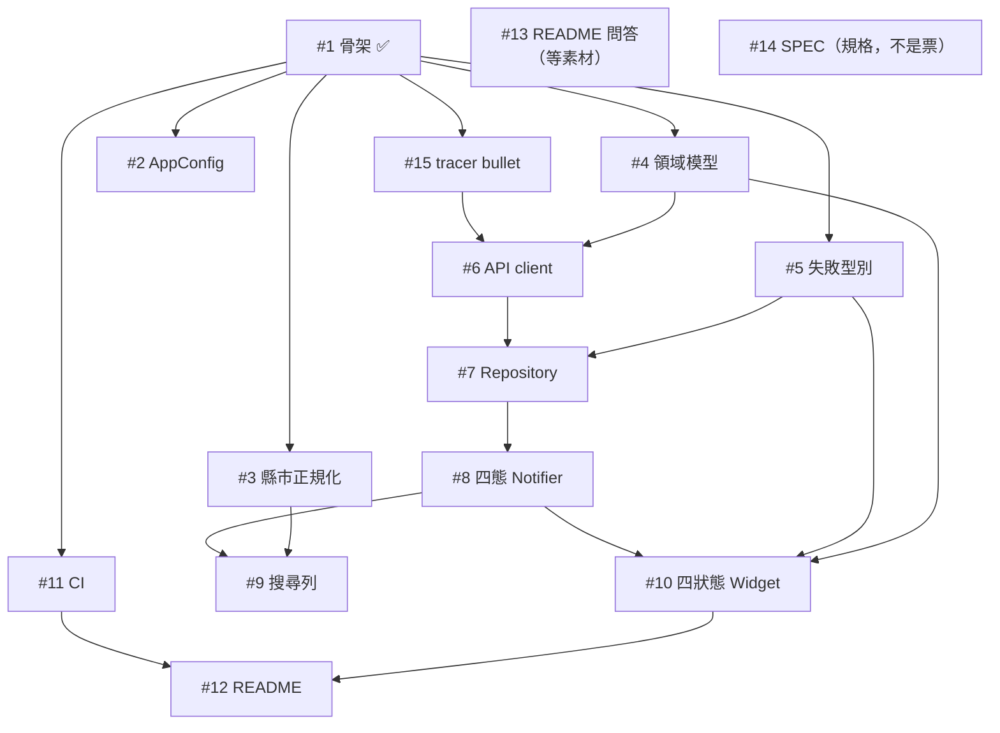

# Delivery

What to do when a ticket's work is done. Applies to `/implement` and to any session that finishes a ticket.

## Steps

1. **Commit** to `main` — no branch, no PR (Q14). End the message with `Refs #<n>`.
2. **Push.**
3. **Close the ticket**: tick the acceptance criteria in the body, then `gh issue close <n> --comment "..."` with the commit sha and how each criterion was verified.
4. **Hand off**: name the next ticket and print the prompt below, filled in, so a fresh session can start from a paste.

Step 3 is load-bearing: tickets are wired with GitHub's native dependencies, so the rest of the backlog only becomes reachable once its blockers are **closed**. Commits alone move nothing. Find the next ticket with the frontier query in [issue-tracker.md](issue-tracker.md).

## Ticket order

Order comes from the **blocking edges**. Ticket numbers don't set it, and neither do the `area:` labels — those classify, they don't schedule. `docs` runs near *last* (#12 waits on #11 and #10); #14 sits outside the order entirely, being the spec rather than a ticket.

GitHub holds the authoritative edges. Re-derive the picture at any time:

```bash
gh issue list --state all --limit 30 --json number,title,state,blockedBy \
  --jq 'sort_by(.number)[] | "#\(.number) \(.state) blockedBy=[\(.blockedBy.nodes|map("#"+(.number|tostring))|join(","))]  \(.title)"'
```

Snapshot as of 2026-08-25, with #1 closed:



**Critical path**: `#1 → #15 → #6 → #7 → #8 → #10 → #12`. It sets the finish date, so when several tickets are free, the one on the path wins. #2, #3 and #11 sit off it and slot in wherever their edges allow.

The edges force only this much: #4 and #15 before #6; #5 before #7 and #10; #3 before #9; then #6 → #7 → #8 → #10 → #12. Everything else is judgement. The order used here:

`#15 → #4 → #2 → #5 → #6 → #7 → #8 → #3 → #9 → #10 → #11 → #12`, with #13 whenever its material arrives.

#15 leads deliberately. The implementation tickets are sliced horizontally by layer, which means nothing renders until #10 and a wrong assumption about the upstream contract would surface only at the end; #15 buys that risk down for the price of one ticket. See the Further Notes in #14.

## Handoff prompt

```
規格在 #14，決策脈絡在 docs/GRILL_LOG.md，詞彙在 CONTEXT.md。先讀這三份。

/implement #<n>

- 用 /tdd，只在 #14 列出的五個接縫上測
- 只做這一張票
```

The delivery steps above need no restating in the prompt: this file is reached from `AGENTS.md` on every session.

## Code review runs once, at the end

`/implement` ends by calling `/code-review`. Here that review runs **after the last implementation ticket**, covering the whole delivery in one pass, and its report is published as a GitHub issue (Q37).

## When reality contradicts a decision

Implementation sometimes disproves a decision made during grilling (see F41–F44 under Q30). Record the correction in all three places, each in its own voice — `docs/GRILL_LOG.md` carries the reasoning, the ticket carries the acceptance criteria, the code carries a one-line comment. Copying one wording into all three produces contradictory specs; see the Further Notes in #14.
